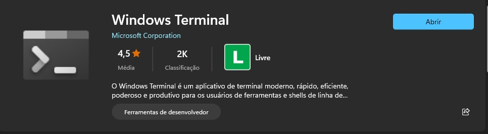
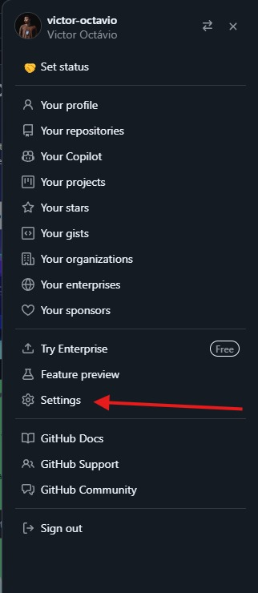
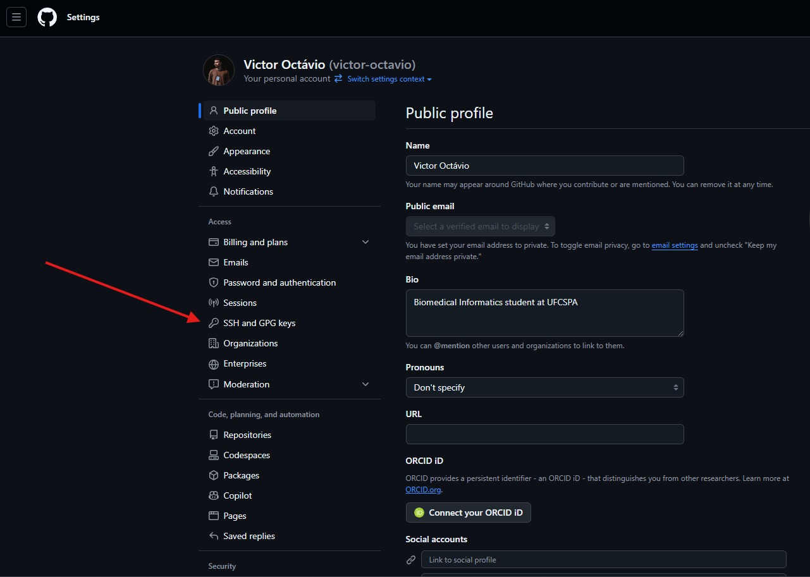
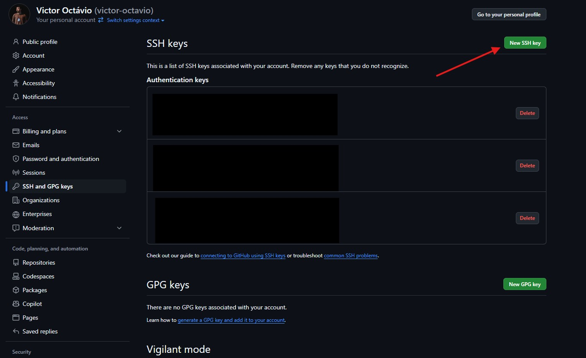
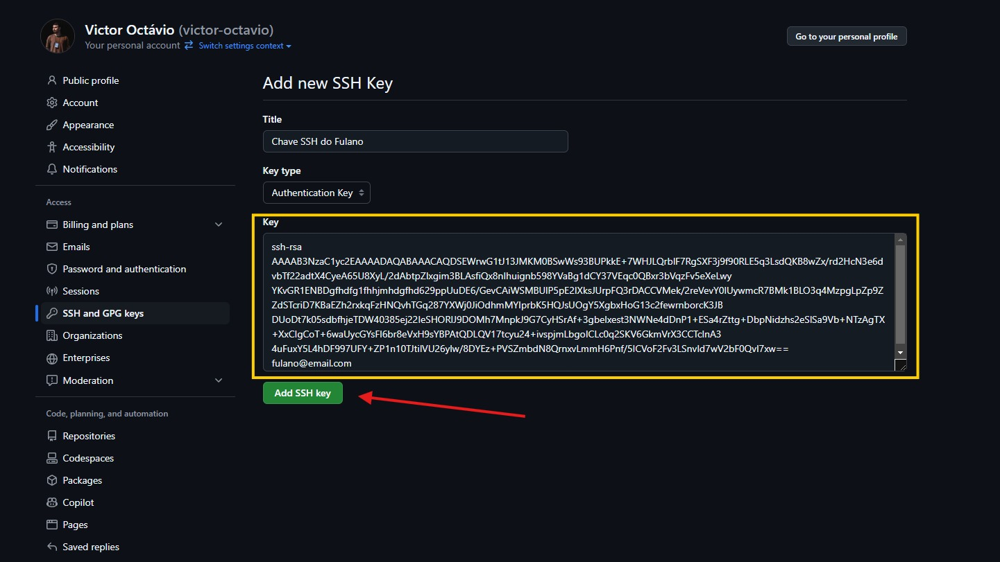

# Oficina de Git e GitHub

## Primeiros passos para configuração do ambiente local:

### Pré Requisitos:
- É altamente recomendado a utilização de um terminal no estilo PowerShell/Bash que aceite comandos como `cat`, `ls` e etc.
- A recomendação em ambiente Windows é utilizar o `Windows Terminal` que já vem instalado em máquinas com Windows 11, caso não seja o seu caso ele pode ser facilmente instalado pela `Microsoft Store`
  <hr/> 
  <div style="text-align: center;">  
     
    </div>
### 1. Realizar download e instalação do Git em sua máquina
- Acessar o site do Git e realizar o download  ([Link de download do Git](https://git-scm.com/downloads))
  ou se preferir, de forma mais simples no ambiente Windows podemos executar o seguinte comando:
    ```
    winget install --id Git.Git -e --source winget
    ```
- Após a instalação, abrir o terminal local e verificar se o comando:
   ```
  git --version
   ```
  é executado corretamente de forma com que o output esperado no terminal seja algo do tipo:
    ```
    git version 2.46.0
    ```
- Configurar informações de usuário no ambiente local com os seguintes comandos no terminal
  - Configurar nome do usuário:
    ```
      git config --global user.name "Fulano de Tal"
    ```
  - Configurar email do usuário:
    ```
      git config --global user.email fulanodetal@exemplo.br
    ```
### 2. Criar uma conta no GitHub
- Acessar o site do [GitHub](https://github.com/) e criar uma nova conta.
  - Após criar uma nova conta devemos vincular uma chave SSH do ambiente local à sua conta do GitHub:
  - Esta etapa da configuração pode ser um pouco chata então vou deixar um vídeo como forma de auxílio caso seja necessário ([Link do vídeo](https://www.youtube.com/watch?v=B4p5P3UlD6I))
  
  1. Para gerar uma chave SSH devemos utilizar o seguinte comando no terminal:
       ```
       ssh-keygen -t rsa -b 4096 -C "seu_email_aqui@email.com"
       ```
  2. Logo após, a seguinte informação deve aparecer em tela:
       ```
       Enter file in which to save the key (C:\Users\fulano/.ssh/id_rsa):
       ```
       Aperte a tecla `Enter` para seguir pra próxima etapa
  
  3. Neste momento irá aparecer a mensagem:
      ```
      Enter passphrase (empty for no passphrase):
      ```
      Se você deseja ter uma senha que deve ser digitada toda vez que uma alteração no código é feita (não recomendo kkk) é neste momento que você deve criar ela, 
      caso contrário só aperte `Enter` e não será gerada nenhuma senha.
      ```
      Enter same passphrase again:
      ```
      Aqui é só apertar `Enter` de novo e ta tudo certo.
  
  4. E finalmente após todo esse processo uma mensagem como essa deve ser gerada:
      ```
      Your identification has been saved in C:\Users\fulano/.ssh/id_rsa
      Your public key has been saved in C:\Users\fulano/.ssh/id_rsa.pub
      The key fingerprint is:
      SHA256:**************** *********@gmail.com
      The key's randomart image is:
      +---[RSA 4096]----+
      |      .+*o*      |
      |       =.o *     |
      |      o B =      |
      |   . o = X *  +  |
      |  o o . S *      |
      | . . * + % .     |
      |  E...+ = = .    |
      |  oooo.+ o o     |
      | . o+o. *        |
      +----[SHA256]-----+
      ```

### 3. Vincular a chave SSH gerada ao GitHub
- Nesta etapa iremos copiar o conteúdo da chave gerada no arquivo `id_rsa.pub`, que deve estar localizada no local onde foi salva nos passos anteriores,
no exemplo anterior ela foi salva no path `C:\Users\fulano/.ssh/id_rsa.pub`
- Devemos acessar o diretório em que a chave foi salva, neste caso a minha foi salva no diretório do meu usuário padrão do computador, acredito que a de vocês seja o mesmo caso
 ```
 # O terminal de vocês deve abrir e ter esse diretório por padrão muito provavelmente
 
 C:\Users\teu_usuario_aqui>
 ```
 Caso seja este o caso, iremos mudar de diretório através do seguinte comando:
```
cd .\.ssh\
```
 e logo em seguida iremos localizar os arquivos presentes no diretório através do comando no terminal:
```
ls
```
o resultado deve ser parecido com isso:
```
PS C:\Users\fulano\.ssh> ls


    Diretório: C:\Users\fulano\.ssh


Mode                 LastWriteTime         Length Name
----                 -------------         ------ ----

-a----        19/09/2024     12:50           3389 id_rsa
-a----        19/09/2024     12:50            751 id_rsa.pub 👈 (vamos usar este)

```
Agora só precisamos copiar o conteúdo dentro deste arquivo através do comando `cat` que vai imprimir um output no terminal com as informações desse arquivo.
```
cat .\id_rsa.pub
```
O resultado deve ser parecido com esse:
```
PS C:\Users\fulano\.ssh> cat .\id_rsa.pub
ssh-rsa AAAAB3NzaC1yc2EAAAADAQABAAACAQDSEWrwG1tJ13JMKM0BSwWs93BUPkkE+7WHJLQrblF7RgSXF3j9f90RLE5q3LsdQKB8wZx/rd2HcN3e6dvbTf22adtX4CyeA65U8XyL/2dAbtpZIxgim3BLAsfiQx8nIhuignb598YVaBg1dCY37VEqc0QBxr3bVqzFv5eXeLwy
YKvGR1ENBDgfhdfg1fhhjmhdgfhd629ppUuDE6/GevCAiWSMBUlP5pE2IXksJUrpFQ3rDACCVMek/2reVevY0IUywmcR7BMk1BLO3q4MzpgLpZp9ZZdSTcriD7KBaEZh2rxkqFzHNQvhTGq287YXWj0JiOdhmMYIprbK5HQJsUOgY5XgbxHoG13c2fewrnborcK3JB
DUoDt7k05sdbfhjeTDW40385ej22IeSHORlJ9DOMh7MnpkJ9G7CyHSrAf+3gbelxest3NWNe4dDnP1+ESa4rZttg+DbpNidzhs2eSlSa9Vb+NTzAgTX+XxCIgCoT+6waUycGYsFI6br8eVxH9sYBPAtQDLQV17tcyu24+ivspjmLbgoICLc0q2SKV6GkmVrX3CCTclnA3
4uFuxY5L4hDF997UFY+ZP1n10TJtilVU26ylw/8DYEz+PVSZmbdN8QrnxvLmmH6Pnf/5ICVoF2Fv3LSnvId7wV2bF0QvI7xw== 
fulano@email.com
```
Após isso iremos copiar o conteúdo que foi impresso no terminal, podem selecionar tudo e dar um `Ctrl C`

Agora iremos para o GitHub vincular essa chave SSH em nossa conta
- Primeiramente iremos abrir o nosso perfil no GitHub e procurar a aba `settings` 

    
- Agora iremos procurar pela aba `SSH and GPG keys`

    
- Clique em `New SSH key`

    

- Insira um título para a sua nova chave e logo após insira a chave que copiamos no terminal no campo específico

  

### 4. Tá pronto o sorvetinho, agora é só esperar e dia 27/09 nos encontramos novamente para o início da oficina  🐈🚀  
